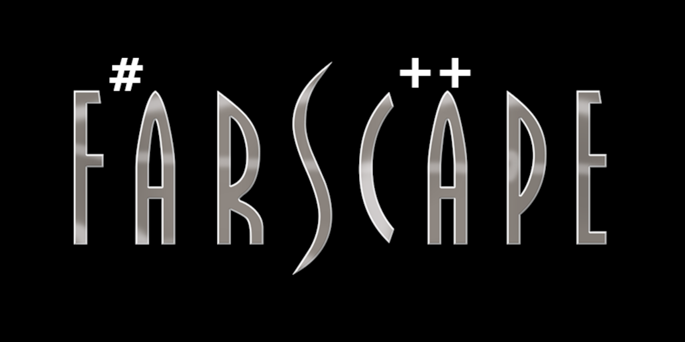

# Farscape: F# Native Library Binding Generator

[](https://opensource.org/licenses/MIT)

Farscape is a command-line tool that aims to automatically generate idiomatic F# bindings for C/C++ libraries, preserving F# intrinsics. It leverages LibClang through CppSHarp to parse C++ headers and produces F# code that can be directly used in both native and .NET based F# applications (and we have plans to eventually support C#/.NET as well through fluent API bindings).

<table>
  <tr>
    <td align="center" width="100%">
      <strong>⚠️ Caution: Experimental ⚠️</strong><br>
      This project is in early development and not ready for production use.
    </td>
  </tr>
</table>

## Features

- **C++ Header Parsing**: Uses CppSharp/LibClang to accurately parse C++ header files
- **Idiomatic F# Code Generation**:
  - C++ namespaces to F# modules for harmony between APIs
  - C++ unions/variants to F# discriminated unions for type-safe pattern matching
  - C++ const-correctness principles translated to idiomatic F# immutability
  - C++ templates to F# generics and SRTPs for type-safe polymorphism
  - More Demanding C++ templates could be supported by F# type providers
- **P/Invoke Support**: Automatically creates proper P/Invoke declarations for native functions
- **Type Mapping**: Precise numeric types __*with matching bit widths and signedness*__
- **Cross-Platform Bindings**: Generated code will work seamlessly with dependencies built for Windows, Linux, macOS, as well as mobile and IoT platforms
- **Project Generation**: 🚧 Targets the creation of complete F# projects ready for building 🚧
- **Documentation**: C++ documentation transferred as F# XML docs for consistent developer experience in all IDEs and code editor environments.

---

---
### Current Implementation

We've successfully created a working implementation for cJSON.h that:
- Automatically extracts function declarations, structs, and type definitions
- Generates appropriate P/Invoke declarations with correct calling conventions
- Maps C++ types to their F# equivalents (though with some conversion issues like char* → byte)
- Produces usable bindings that can be incorporated into F# projects

The current solution is intentionally focused on cJSON as a proof of concept. This simplified approach paves the way to a progressive implementation of more supported features. Eventually more complex C++ projects will be "placed on the bench" to determine how best to support more complicated APIs. The end result will eventually yield a mature tool that will cover a majority of support scenarios.

### Generalization Requirements

To fulfill Farscape's vision of supporting any C++ library, the implementation needs to be generalized:

1. **Develop a more complex header parsing system**:
    - Enhance CppSharp integration for more detailed and varied header parsing
    - Support standard C/C++ constructs across various library styles
    - Handle platform-specific details and preprocessor directives

2. **Improve type mapping**:
    - Refine string handling (currently mapping to byte instead of proper string marshaling)
    - Broader support for complex types, structs, and templates
    - Transform C++ function pointers into F# functional delegate definitions including built-in lifecycle management

3. **Support diverse library patterns**:
    - Handle C-style libraries like cJSON
    - Support C++ classes and object-oriented patterns
    - Accommodate different calling conventions and export styles

The current hybrid approach for cJSON demonstrates the feasibility of this vision, and serves as a template for generalization to other libraries.

___

---

## Prerequisites

- [.NET 9.0 SDK](https://dotnet.microsoft.com/download/dotnet/9.0) or later
- [LLVM/Clang](https://releases.llvm.org/download.html) with development components (for LibClang)

## Installation

### From Source

```bash
# Clone the repository
git clone https://github.com/speakez-llc/farscape.git
cd farscape

# Build the project
./build.ps1

# Install as a global tool
dotnet tool install --global --add-source ./src/Farscape.Cli/nupkg farscape
```

## Usage

```bash
# Basic usage
farscape generate --header path/to/header.h --library libname

# With additional options
Farscape.Cli generate [options]

Options:
  -h, --header <header> (REQUIRED)     Path to C++ header file
  -l, --library <library> (REQUIRED)   Name of native library to bind to
  -o, --output <output>                Output directory for generated code [default: ./output]
  -n, --namespace <namespace>          Namespace for generated code [default: NativeBindings]
  -i, --include-paths <include-paths>  Additional include paths
  -v, --verbose                        Verbose output [default: False]
  -?, -h, --help                       Show help and usage information
```

## Examples

### Basic Example

Assume you have a simple C library with a header like this:

```c
// math_lib.h
#pragma once

#ifdef __cplusplus
extern "C" {
#endif

// Adds two integers
int add(int a, int b);

// Multiplies two doubles
double multiply(double a, double b);

#ifdef __cplusplus
}
#endif
```

Generate F# bindings with:

```bash
farscape generate --header math_lib.h --library mathlib
```

The generated F# code will look like:

```fsharp
namespace NativeBindings

open System
open System.Runtime.InteropServices

module NativeBindings =
    /// <summary>
    /// Adds two integers
    /// </summary>
    [<DllImport("mathlib", CallingConvention = CallingConvention.Cdecl)>]
    extern int add(int a, int b)
    
    /// <summary>
    /// Multiplies two doubles
    /// </summary>
    [<DllImport("mathlib", CallingConvention = CallingConvention.Cdecl)>]
    extern double multiply(double a, double b)
```

## Advanced Topics

### Self-Hosting as Working Proof

Farscape will eventually be used to generate F# bindings for LibClang itself, creating a self-hosting cycle.

### MLIR/LLVM Integration

The architecture is designed with potential pairing with F#-built executables in mind - [built with MLIR/LLVM lowering](https://github.com/speakez-llc/fsharp-mlir-hello), enabling compilation to native code as well as support the current standard .NET runtime.

### Delegate Pointer Handling

Special handling for C++ function pointers and delegates will be included, with support for marshaling between F# functions and C++ callbacks.

## Contributing

Contributions are welcome! Please feel free to submit a Pull Request.

1. Fork the repository
2. Create your feature branch (`git checkout -b feature/amazing-feature`)
3. Commit your changes (`git commit -m 'Add some amazing feature'`)
4. Push to the branch (`git push origin feature/amazing-feature`)
5. Open a Pull Request

## License

This project is licensed under the MIT License - see the LICENSE file for details.

## Acknowledgments

- [CppSharp](https://github.com/mono/CppSharp) for its deep coverage of LibClang
- [LLVM/Clang](https://llvm.org/) project for LibClang
- [SpectreCoff](https://github.com/EluciusFTW/SpectreCoff) and Spectre.Console that it wraps
- F# community for inspiration and support
- .NET runtime for P/Invoke support
